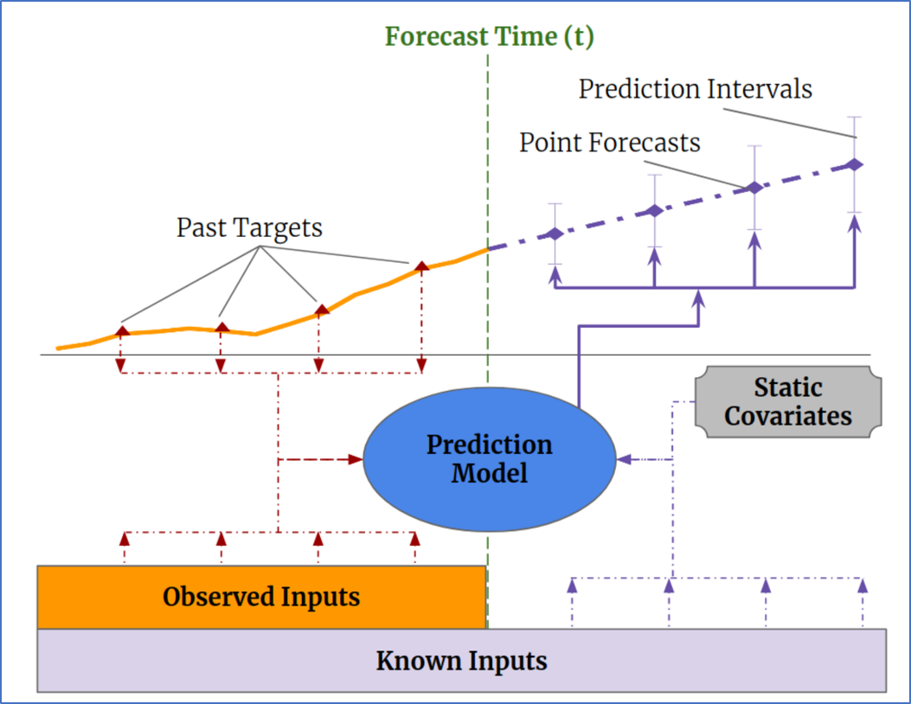
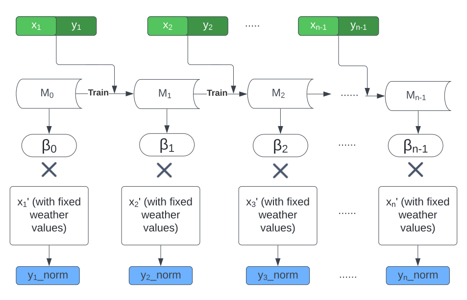
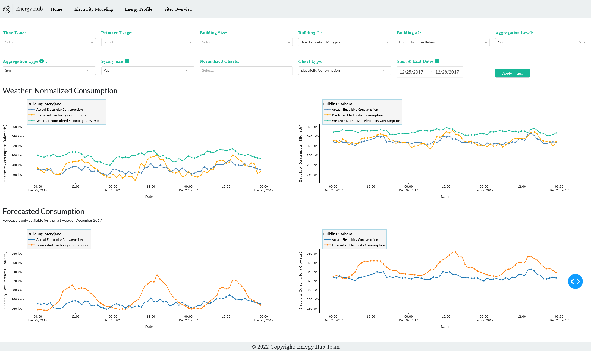
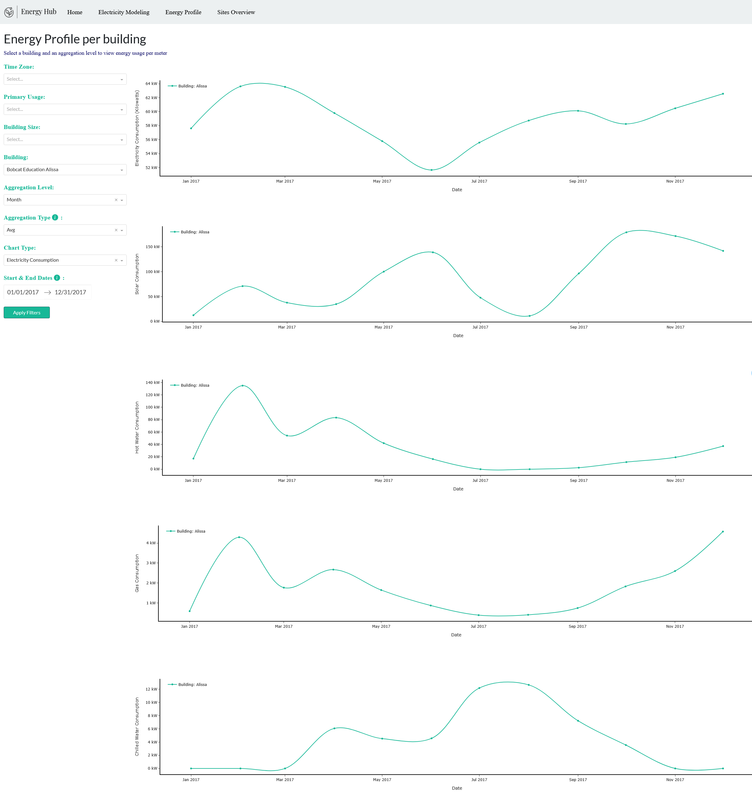
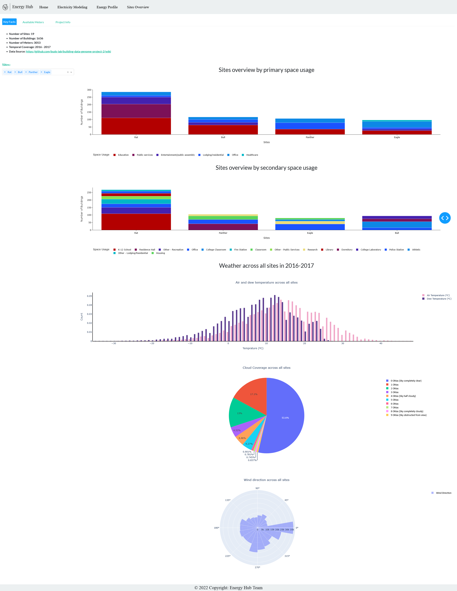
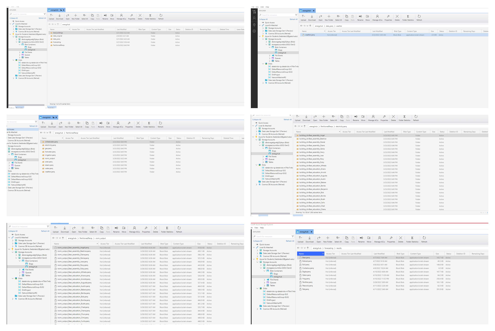

# Energy Hub: Building an Energy Management Platform

Energy hub is an energy management platform that combines an interactive dashboard with the state of the art deep learning transformers architecture and online machine learning models for weather normalization purposes

## :bookmark_tabs: Table of Contents
- [Introduction](#Introduction)
- [Description](#Description)
- [Dataset](#Dataset)
- [Live Demo](#demo)
- [Installation Requirements](#requirements)
- [Installation and Execution](#Installation)
- [Resources](#resources)

### :loudspeaker: Introduction

Global energy consumption is expected to reach `225,000` TWh in 2035. Buildings’ energy usage stands for approximately 40% of the global demand while generating 30% of the CO2 emissions. All of this requires energy management professionals to have the right tools to track energy KPIs for data driven energy optimization, carbon modeling, and budgeting. This holds especially true with world leaders’ commitment to limit global warming effects through the signing of the Paris Climate Accords, which aims to limit global warming to 1.5 degrees Celsius. The goal of this project is to develop an analytical web application for buildings’ energy management. This app presents interactive visualizations to summarize energy KPIs. It is powered by a machine-learning based energy benchmarking solution for energy deviation reporting, as well as deep learning models to provide mid-term energy forecast. 

### :information_source: Description
 
Our website is built using Dash Plotly framework and is made up of 4 main pages. In the home page we introduce the project and the team. Next, in the electricity modeling page we have a unique variety of filters that allows users to choose their aggregation level, chart duration, and which data elements to be shown on the charts among many other novel options. The goal is to allow users to compare electricity consumption of two buildings at a time. The other two pages allow the users to explore the energy usage of every building in the dataset per meter type and see the distribution of the primary/secondary usage for buildings in each site, as well as the average weather over 2016-2017 time period. All the pages are mobile friendly and can be viewed on mobile or tablet.

### :information_source: Modeling

To simulate real life production system, we opted to do incremental normalization. Using RiverML, we converted our dataset into a data stream, where transformation, training, prediction, and updating happen one data point at a time. Model is updated using Stochastic Gradient Descent optimizer. Once the model was established at each time step, we set the weather features to fixed values: an air temperature of 25C, a dew temperature of 25C, wind direction and speed both at zero, and obtained the normalized values.    

Temporal Fusion Transformer was used for forecasting electricity consumption for 168 hours. We take advantage PyTorch Forecasting library’s multi group forecasting feature. We build one model per site where sites with limited features or large null values were not modelled, totaling 10 models. Weather information along with building meta information was used to build the forecasting model.

  
  

#### :page_with_curl: Main forecast page

  

#### :page_with_curl: Buildings' overview page

   

#### :page_with_curl: Sites overview page

  

### :file_folder: Dataset

Our dataset comes from The Building Data Genome Project 2, which can be downloaded from [here](https://github.com/buds-lab/building-data-genome-project-2). This dataset consists of 3,053 energy meters from 1,636 non-residential buildings in 19 sites across North America and Europe (see interactive map). The readings were recorded at one-hour intervals for electricity, chilled water, hot water, steam, irrigation and solar for 2016 and 2017. Buildings’ metadata includes year built, size, primary use, site, and source energy use intensity (EUI). Weather data (temperature, pressure, humidity, etc.) comes from the National Centers for Environmental Information database. Our dataset is approximately 2.6 GB in size, with nearly 53.6 million readings. 

The dataset is stored in Azure Data Lake (see image below on how the dataset was stored)

  

### :movie_camera: Live Demo

The app is deployed on Azure websites and can be viewed at https://energyhub.azurewebsites.net/

#### :pick: Installation Requirements

* Download an IDE. We highly recommend VScode
* Download `Python-3.9.11` [here](https://www.python.org/ftp/python/3.9.11/python-3.9.11-amd64.exe)
* Create an Azure account, a Data Lake Storage Gen 2 account, Azure Key vault, and Azure Webapp registration account (see resources)
* Add Azure Client Secret key, Client ID, and Tenant ID to your environment variables

### :hammer_and_pick: Installation and Execution

1. In the project folder, create a virtual environment using the following steps:
	* Open GitBash or Command prompt
	* Run:  `py -m venv .venv`
	* Run: `source .venv\Scripts\activate
	* Install requirements:  `pip install -r requirements.txt`
	
2. Run the notebooks in the **"data_prep"** folder which will prep the data and upload it to Azure Data Lake Storage

	* execute `meta_weather_clean.ipynb`
	* execute `meters_clean.ipynb`
	
3. Run the notebooks in both **"forecast"** and **"normalization"** folders
	* Note: Forecast model must be ran for each site one at a time and the model results will upload to Azure storage automatically
	
4. Convert & Partition the cleaned meter readings files to parquet files using pandas. The `webapp/partitionParqs.py` will help you do that

6. Update the `data.py`  under **webapp** folder to follow your folder structure in Azure

8. Go to **webapp** folder in your command line

	* Run `code .` to open a vscode code in the folder
	* In your command line, run `python application.py`
	* Dash will open a localhost address for you in the command line, follow the link

### :open_file_folder: Resources

* Set up a Azure account
	* [Azure account](https://docs.microsoft.com/en-us/learn/modules/create-an-azure-account/)
	
* Create a data lake account
	* [Data Lake](https://docs.microsoft.com/en-us/azure/storage/blobs/create-data-lake-storage-account)

*  Create a key vault using the Azure portal
	* [Key Vault](https://docs.microsoft.com/en-us/azure/key-vault/general/quick-create-portal)
	
* Register an application
	* [Register App](https://docs.microsoft.com/en-us/azure/active-directory/develop/quickstart-register-app)

* How to write a partitioned Parquet file using Pandas
	* [Parquet file using Pandas](https://stackoverflow.com/questions/52934265/how-to-write-a-partitioned-parquet-file-using-pandas)

* Write a DataFrame to the binary parquet format
	* [Convert Pandas Dataframe to parquet](https://pandas.pydata.org/pandas-docs/version/1.1/reference/api/pandas.DataFrame.to_parquet.html)
